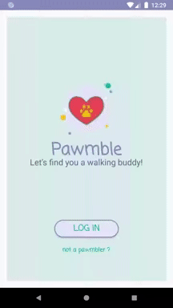
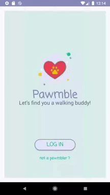
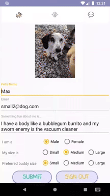

# Pawmble

#### C13 Capstone Project - Denisse A - Time Classroom

This is the repository for Pawmble - an Ada Developers' Academy capstone project. The project was built using the tech stack - Android Studio, Firebase database, Kotlin and Firebase authentication. Please follow the links to find project information and installation instructions.

## Table of Contents
* [Introduction](#introduction)
* [Android Studio Mobile App](#android-studio-mobile-app)
* [Wireframes and Trello](#links)
* [Screenshots](#screenshots)

## Introduction

**The problem**: Keeping your dog and yourself physically and mentally healthy by going on walks with other dog owners.

**The solution**: The app Pawmble will help find your next walking buddy (dog owner included).
  * [Video Demo](https://www.youtube.com/watch?v=UhsWZCaycJc&feature=youtu.be)

## Android Studio Mobile App

### Use cases
* This app allows users to find a walking buddy based on the dog's preferences and other dog's characteristics
* The user is able to organize a walk via chat with other dog owners only if both have liked their dog's profile

## Links
* [Wire frame](https://docs.google.com/presentation/d/1pAzuexPu6B2rhK_sQ3a6et7K8SsEXZc_v6DU3uvi7Wg/edit?usp=sharing)
* [Trello Board](https://trello.com/b/AnDLvDsb/capstone)

## Screenshots
#### Emulator used Nexus 6P with API 27
     
#### ------------Login------------------Sign Up/Swipe-------------------------Chat

### Installation Instructions
1. Clone Repo
2. Download [Android Studio](https://developer.android.com/studio?hl=es) use API 27 with a min SDK of 16
3. Create [Firebase Account](https://firebase.google.com/) for database storage and authentication

